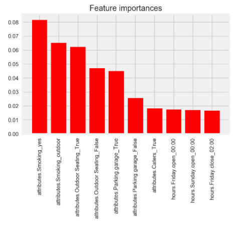

# Yelp-Challenge-Dataset

I explored 4 questions using several publically available datasets from Yelp. This was part of a homework assignment for GA's Data Science Immervise, so I my goal was to exercise a wide set of new skills, instead of creating accurate models. 

## Question 1
---
**Question**
Predict whether a business resides in las vegas using only keywords from customer reviews. What are the most significant predictors for classifying a business as being based in Las Vegas?

**Results**
I attempted to do some feature engineering, and used random forest to create a model to predict whether the business was located in las vegas. My baseline precision was 0.62, and my model had a 5 fold cross validated precision of 0.66. Test precision was 0.67 and recall was 0.93. 

The top 10 features (by magnitude of coefficient) were as follows:

**Conclusion**
The largest factor to a business' location being classified as Las Vegas is 'mMoking' == yes, which in a way makes sense. Outdoor seating, outdoor smoking, and having a parking garage were also big factors for las vegas, which also makes sense - a lot of people expect to be able to smoke wherever in vegas, and the high density of shops/casinos/businesses on the strip means you need a lot of parking garages.

We decided to move on from this question after putting in around 6 hours, but if I were to move forward I would do some more feature engineering. In particular I would see which businesses are open late during weekdays, because I think vegas businesses would be more likely to be open all hours. 
