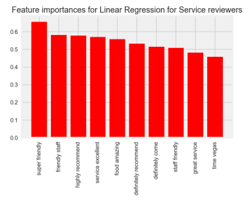
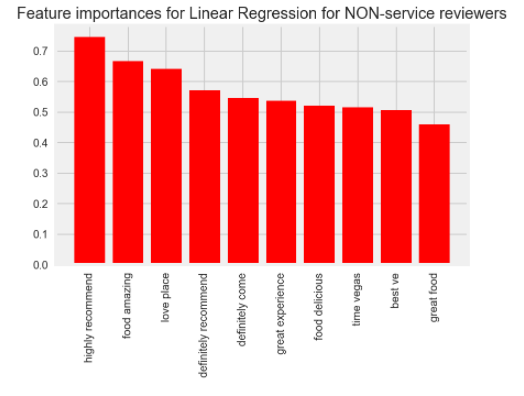
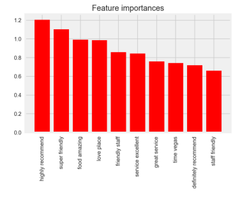
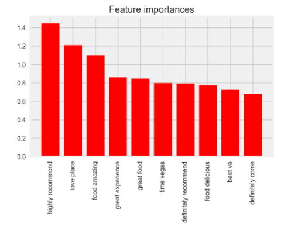
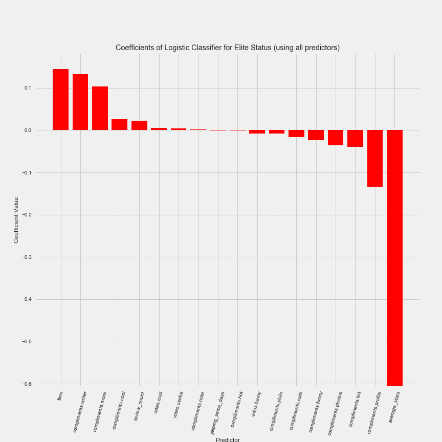
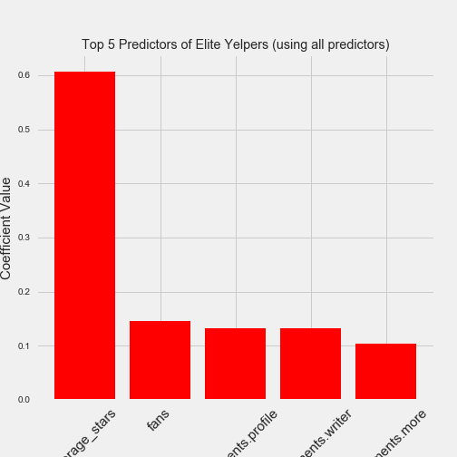

# Yelp-Challenge-Dataset

I explored 4 questions using several publically available datasets from Yelp. This was part of a homework assignment for GA's Data Science Immervise, so I my goal was to exercise a wide set of new skills, instead of creating accurate models. 

## Question 1
---
**Question**
Predict whether a business resides in las vegas using only keywords from customer reviews. What are the most significant predictors for classifying a business as being based in Las Vegas?

**Results**
I attempted to do some feature engineering, and used random forest to create a model to predict whether the business was located in las vegas. My baseline precision was 0.62, and my model had a 5 fold cross validated precision of 0.66. Test precision was 0.67 and recall was 0.93. 

The top 10 features (by magnitude of coefficient) were as follows:

**Conclusion**
The largest factor to a business' location being classified as Las Vegas is 'mMoking' == yes, which in a way makes sense. Outdoor seating, outdoor smoking, and having a parking garage were also big factors for las vegas, which also makes sense - a lot of people expect to be able to smoke wherever in vegas, and the high density of shops/casinos/businesses on the strip means you need a lot of parking garages.

We decided to move on from this question after putting in around 6 hours, but if I were to move forward I would do some more feature engineering. In particular I would see which businesses are open late during weekdays, because I think vegas businesses would be more likely to be open all hours. 

## Question 2
---
**Question**
Do some users tend to talk about service more than others in reviews/tips? Predict whether a user is a service oriented reviewer, or not, and explore which predictors are most significant to classifying a user as service oriented. 

**Results**
I first used linear regression to create a model to predict if a user was a 'service-oriented' user. 

The top 10 features (by magnitude of coefficient) were as follows:

We also used Multi class logistic regression to predict 'service-oriented' users.

The top 10 features (by magnitude of coefficient) were as follows:

**Conclusion**
Conclusion based on Linear regression: Although we didn't validate our model (would definitely need to cross validate in order to trust results), the top 10 features of service customers include 5 mentions of service. Out of The top 10 features for non-service reviewer none mention service. although I wouldn't call this a comphrenesive study into the question, our cursory overview into the question leads us to believe that the two reviewers are different, or in other words, the most important factors that determine how a user is going to rate a restaurant are actually different between non-customer service oriented reviews and customer service oriented reviews. This suggests that there are two different types of reviewers - those who care about service, and those who don't care about service as much when rating a restaurant.

Conclusion based on multiclass logistic classification: We didn't have time to validate our model, because we aren't sure how to validate a multi-class model, however service features represent 50% of the top 10 features in predicting 5 stars for 'service' oriented customers, and service features represented 0% of the top 10 features in predicting 5 stars for 'non-service' oriented customers.

The results from linear regression and multiclass logistic regression suggests the two reviers are really different.

## Question 3
---
**Question**
Find what factors are most significant in yelp's "elite user" algorithm. 

**Results**
Baseline precision was 0.89, our logistic regression model had 5 fold cross validated precision of 0.68. Not good!

The top 10 features (by magnitude of coefficient) were as follows:

**Conclusion**
Most significant predictors for an elite user? Number of fans, number of compliments (Good Writer, and Write More, Like your Profile) and average rating. The negative coef for average_stars indicates that the predictor is inverseley associated with the probability of a user being classified elite. So as a user's rating average increases the likelihood that they are elite decreases significantly.

## Question 3
---
**Question**
Predict if a business is of category 'fast food' based on characteristics of the business. 

**Results**
Baseline fast food precision for 1s: 0.263068731849. Our random forest model had a precision score of 0.81, and a recall of 0.9. 

